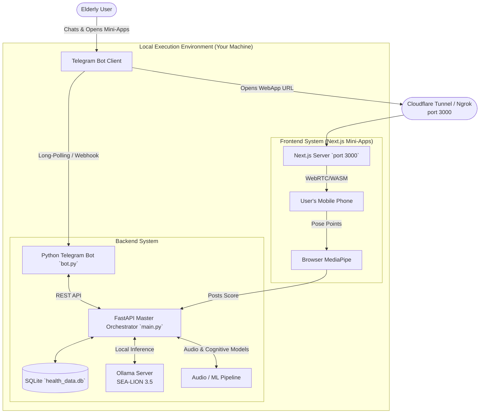

# MERaLiON Health Prototype - NUS-SYNAPXE-IMDA AI Innovation Challenge 2026 🦁

Welcome to the MERaLiON Health Prototype! This repository hosts a full-stack, multimodal health and wellness AI assistant that interfaces entirely through a Telegram Bot. It is powered locally by the **SEA-LION 3.5 8B** model, Next.js web mini-apps, MediaPipe pose tracking, and an ensemble of FastAPI orchestration bridges.

---

## 🏗️ Architecture



### 📂 Repository Structure

```text
├── App Part/
│   ├── backend/                # Python FastAPI + Telegram Bot Logic
│   │   ├── main.py             # Express REST API
│   │   ├── bot.py              # Telegram Long-Polling orchestrator
│   │   ├── ml_bridge.py        # Connects ML to DB logic
│   │   ├── database.py         # SQLite connection manager
│   │   └── health_data.db      # Local Database
│   └── frontend/               # Next.js App Router (Telegram Mini Apps)
│       └── app/
│           ├── chat/           # Text/Audio Chat View 
│           ├── camera-game/    # Facial Muscle Stretch FSM Game
│           └── mobility-game/  # Body Mobility Pose FSM Game (Sit & Stand etc.)
├── ML_stash/                   # Experimental Jupyter Notebooks & raw Python Audio Models
├── RehabAI_Pipeline/           # Isolated Webcam Tracker logic (Python CV2 Reference)
├── docs/                       # General documentation / Bot Prompt personas
├── reference/                  # Legacy hackathon planning PDFs, MDs, specifications
├── complete-build.bat          # The master magic installer
└── run.bat                     # The master orchestrator launcher
```

---

## 🛠️ Tech Stack Used
* **AI Orchestration**: [Ollama](https://ollama.ai/) running `aisingapore/Llama-SEA-LION-v3.5-8B-R:latest`
* **Bot Framework**: `python-telegram-bot`
* **Backend API**: Python 3 `FastAPI` + `Uvicorn`
* **Frontend Apps**: React `Next.js` (App Router) + `TailwindCSS`
* **Client-Side Machine Learning**: `@mediapipe/tasks-vision` (WebRTC + WebAssembly for 60fps tracking)
* **Database**: `SQLite`

---

## 🚀 How to Run as a General User (Testing the App)

If you are a judge or a user looking to just *use* the app, **you do not need to install any code, node, or python**. All processing is handled on the host machine. 

1. Wait for the host developer to boot their server and tunnel.
2. The host will provide you with a **Telegram Bot Username** (e.g. `@MyMERaLiON_Bot`).
3. Search for the bot on Telegram Mobile or Desktop.
4. Click **Start** or type *"Hello!"*
5. The bot (powered by SEA-LION) will chat with you, randomly do check-ins, and selectively deploy "Mini App Games" inside your chat using Telegram WebViews!

*(< INSERT SCREENSHOT OF A CASUAL TELEGRAM CHAT WITH THE BOT SHOWING INLINE BUTTON FOR A GAME HERE >)*

---

## 💻 How to Run as a Developer (Host)

Because Telegram architecture strictly forbids two local servers polling the *exact same Telegram Bot Token* simultaneously, collaboration requires you to have your own duplicate bot for testing.

### Step 1: Pre-Requisites
1. Install [Ollama](https://ollama.ai/).
2. Pull the SEA-LION model locally: 
   ```bash
   ollama run aisingapore/Llama-SEA-LION-v3.5-8B-R:latest
   ```
3. Install [Node.js](https://nodejs.org/) (v18+) and [Python 3.10+](https://python.org/).

### Step 2: Set up your local Test Bot
1. Open Telegram and search for `@BotFather`.
2. Type `/newbot` and follow the prompts to create your own duplicate bot (e.g. `@YourNameTestBot`).
3. Copy the **HTTP API Token** provided by BotFather.
4. Open `App Part/backend/bot.py`.
5. Locate the line `TOKEN = "..."` and replace it with your newly generated test token.

### Step 3: Install Everything Automatically
Simply double-click the massive installer I've written for you. It builds the virtual environments, installs Python dependencies, checks for `FFmpeg`, and runs `npm install` for Next.js in one go.
```bash
# In the root repo layer:
.\complete-build.bat
```

### Step 4: Expose the Frontend to the Internet (Crucial)
Telegram Mini Apps *require* an `HTTPS` URL to load inside the phone. You cannot serve `localhost` to Telegram.
1. Download [Cloudflare Tunnel](https://developers.cloudflare.com/cloudflare-one/connections/connect-networks/downloads/) or run:
   ```bash
   cloudflared tunnel --url http://127.0.0.1:3000
   ```
2. Cloudflare will spit out a random green URL (e.g., `https://random-words.trycloudflare.com`).
3. Update the `BASE_URL` variable inside `App Part/backend/bot.py` with this exact link!

### Step 5: Boot the Megazord 🚀
Double click the launcher:
```bash
.\run.bat
```
This script will:
1. Kill any dangling node/python servers you left alive accidentally.
2. Launch the **FastAPI Bridge** (Port 8080) automatically connected to SQLite.
3. Launch the **NextJS Frontend** (Port 3000).
4. Launch the **Telegram Bot Poller** attached to your custom token.

*(< INSERT SCREENSHOT OF THE 3 TERMINAL WINDOWS (FASTAPI, NEXTJS, BOT) RUNNING SUCCESSFULLY HERE >)*

### Common Troubleshooting During Dev:
- **Bot responds duplicate times:** Make sure you don't have multiple terminals running `bot.py` or `.bat` files open simultaneously. Run `taskkill /F /IM python.exe` via powershell if desperate.
- **Can't load minigame:** Your Cloudflare tunnel URL probably rotated. Restart the tunnel, paste the new link into `bot.py`, and restart `run.bat`.
- **MediaPipe crashes locally:** Make sure you are accessing the app from an `https://` proxy, otherwise modern web browsers block Webcam access citing security flaws.
