# Meramerara - NUS-SYNAPXE AI Innovation Challenge 2026 🦁

  
  <h1 style="font-size: 2em; margin: 10px 0;">Mera</h1>
  
The Digital Health Companion

  
DM our working prototype on Telegram: <strong>@Meramerarabot</strong>

## 🌟 The Pitch & Premise
**Frictionless Healthcare without Boundaries.** 
The biggest hurdle to remote healthcare monitoring in chronic patients and vulnerable populations is the friction of technology—downloading apps, setting up accounts, logging in, and navigating unfamiliar UIs.

**Why a Telegram Bot instead of a Native App?**
*   **Zero-Friction Convenience:** Telegram is an app that chronic patients and their families *already use* daily for communication. There is nothing new to learn or install.
*   **Unmatched Engagement:** When comparing the chances of user engagement between an isolated "Health App Push Notification" and a native "Telegram message from a friend", the chat message wins by a landslide. 
*   **Absolute Simplicity:** No tech skills are required to operate this tool. The user simply talks to the bot using text or voice. The bot operates in the background, proactively messaging at set intervals to do light check-ins and deploy tools when necessary.

**Our Solution:** We bypass app installation entirely. The entire patient journey is hosted inside **Telegram**. Using advanced Sovereign Large Language Models (SEA-LION/MERaLiON) and a highly robust **Open Claw architecture**, our solution acts as an empathetic digital companion. Through casual conversation, the system performs *background multimodal health screening*. 

When a vulnerability is detected (e.g., voice fatigue, signs of cognitive decline in audio, or depressive text), the agent dynamically triggers its tools and seamlessly launches localized **Telegram Mini Apps (WebRTC Machine Learning)** to perform active, gamified physiological assessments—all without the user ever explicitly leaving the chat.

---

## 🎯 The Problem Statement
**Tackling Problem Statement 2: AI for Multimodal Remote Health and Wellness Monitoring.**
Our platform delivers on the goal of accessible, non-contact, and continuous monitoring of wellness, stress, and physiological signals. By intelligently fusing **Audio & Linguistic analysis** (passive tracking) with **Visual Pose & Facial tracking** (active assessment), we form a comprehensive and entirely frictionless health trendline for clinicians. 

---

## 🧠 The Companion Bot: "Mera" (@Meramerarabot)

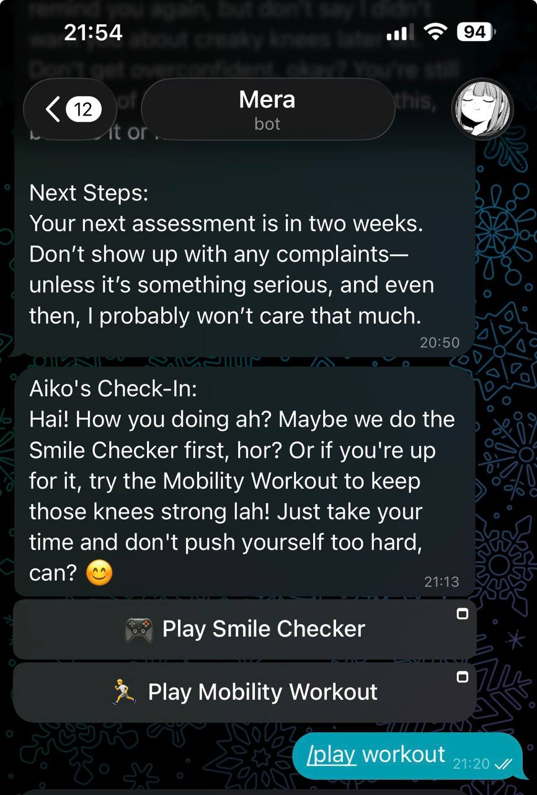

Mera serves as a deeply caring, protective digital guardian with a localized touch.

*   **Personality & Tendencies:** Warm, empathetic, yet highly protective. It speaks the user's language smoothly, caring for the patient's well-being without causing medical panic or overusing forced slang. Its built-in tendency is to disguise serious health interventions as fun minigames. (*"Let's play a quick memory or stretching game to wake you up!"*)
*   **Targeted Skillset & Multimodal Capabilities:**
    *   **Text/Memory Analysis:** Uses conversation history, key patient attributes (fatigue, mobility), and real-time inference to generate perfectly empathetic and medically cautious check-ins.
    *   **High-Fidelity Audio Processing:** Natively digests voice notes. It runs voice data through a local ASR pipeline to transcribe content and dynamically score audio for lethargy and voice fatigue. 
    *   **Image Processing (A Special Architecture):** Uses an **Image Extractor atop the existing SEA-LION foundation for double image extraction**. This approach radically improves accuracy and reduces hallucinations, allowing Mera to "see" shared patient records or physical states effectively before replying. 

---

## ⚖️ Workflow Distribution: Meralion vs SEA-LION

To achieve maximum performance and clinical safety locally, our architecture delegates responsibilities specifically to the strong suits of our Sovereign LLMs:

### MERaLiON (Multimodal Empathetic Reasoning and Learning in One Network)
*   **The Speciality:** Understanding not just *what* is said, but *how* it is said.
*   **Our Workflow Allocation:** MERaLiON excels at natural speech, emotion recognition, and high-quality transcription. We leverage Meralion's underlying philosophy for empathetic voice tracking: dissecting tone, user fatigue, and code-switching in audio inputs. This provides the emotional parameters and deep empathetic anchoring necessary for elderly companionship.

### SEA-LION (Southeast Asian Languages in One Network)
*   **The Speciality:** Linguistic context, reasoning, generation, and safe medical synthesis. 
*   **Our Workflow Allocation:** SEA-LION executes the heavy-duty clinical processing. When interpreting post-minigame metrics (e.g., Facial Symmetry variance, R-PPG heart rate, or complex multi-joint mobility scores) and routing RAG-style factual outputs, we lean fully on SEA-LION. It grounds responses in real guidelines (AHA, CDC) without inventing fake medicine, processes complex JSON parameters, and runs our dual-image extractor module for high-density document reading.

---

## ⚙️ High-Tech Implementations & The "Open Claw" Magic
The core system is vastly more than a simple chatbot—it is an ensemble of bleeding-edge tech:
1.  **Open Claw Architecture:** The dynamic backbone. The system implements versatile "Open Claw" tool-calling, granting the bot an array of skills. It autonomously routes user inputs—deciding in real-time when to invoke the audio transcriber, run clinical sentiment analysis, or deploy targeted Telegram WebApps based entirely on context.
2.  **Privacy-First WebAssembly (WASM) Vision:** Our Next.js Telegram Mini Apps perform all *camera-based facial mesh and skeletal tracking locally within the phone’s browser*. Zero video data is sent to the cloud. It calculates a 'Symmetry or Mobility Score' natively, ensuring 100% data privacy and frictionless deployment. 
3.  **Local Edge Inference (SEA-LION / MERaLiON):** Relying on IMDA/AI Singapore's models optimized for Southeast Asian cultural grounding.

---

## 🔄 The System Finite State Machines (FSM)

### 1. Macro Application FSM (The Patient Journey)
*   **State 0: Empathic Surface (Idle Monitoring):** The bot engages in standard companionship text/audio chat. Natural transcribers and NLP models parse incoming modalities continuously.
*   **State 1: Dynamic Escalation (The Bridge):** An anomaly is logged via the transcribers/ML (e.g., negative text threshold crossed). The LLM automatically transitions priority from "Chat" to "Diagnostics", utilizing Open Claw to inject a diagnostic Mini App button.
*   **State 2: Active Gamified Assessment (Visual/Motor):** The user engages the WebApp over their camera. Client-side MediaPipe tracks high-framerate skeletal joints or 478-point facial meshes.
*   **State 3: Data Aggregation & Intervention:** The game computes interval metrics, POSTs to the FastAPI backend, evaluates the timeline curve, and orchestrates caretaker alerts if critical thresholds are broken.

### 2. Micro Gameplay FSM (Clinical Visual Tracking)
Within our Next.js frontend, we employ rigorous biomechanical State Machines to guarantee clinical compliance, bypassing any ability for the user to "cheat" the camera.

#### A. The Active Mobility Game

    

        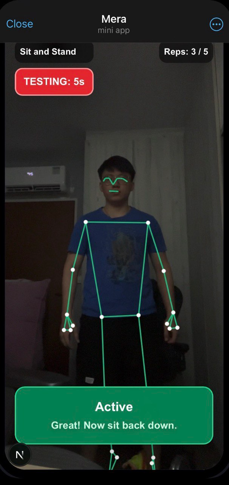 
        Front View
    

    

        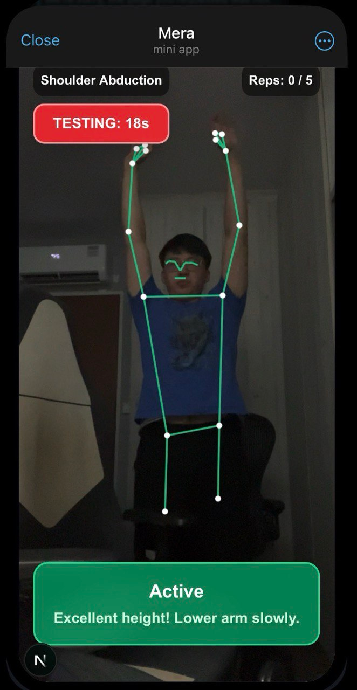 
        Raise Hands
    

    

        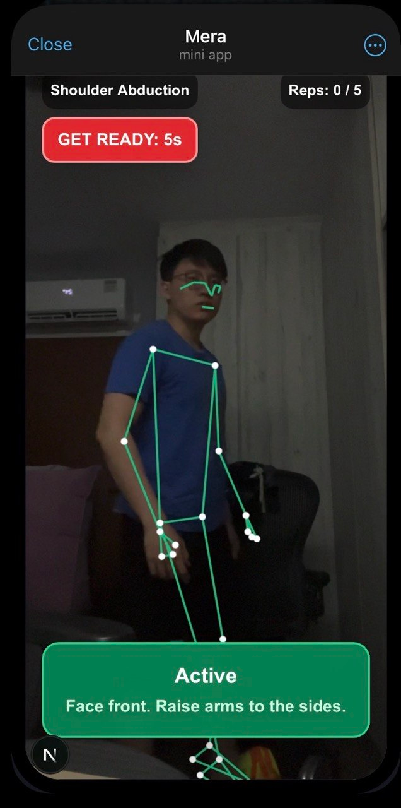 
        Sideways
    

    

        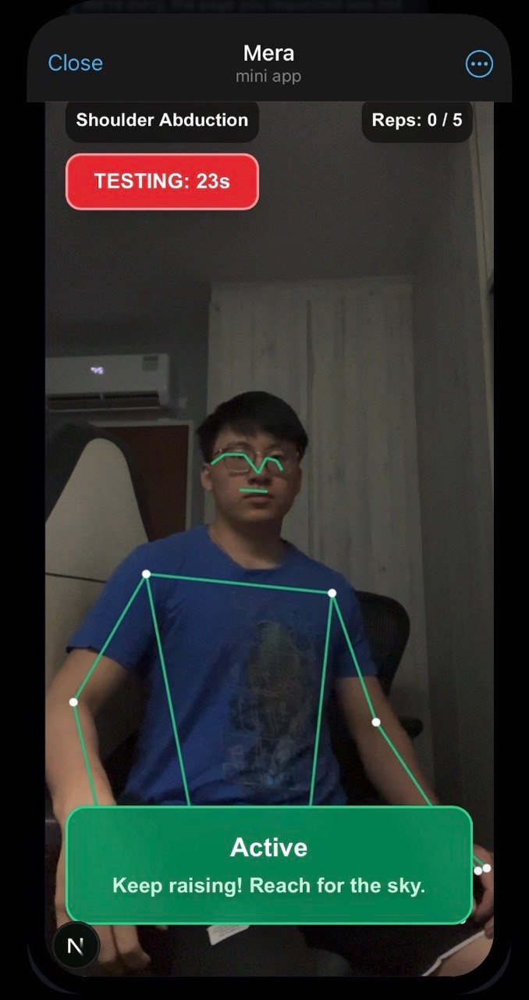 
        Sit
    

We dynamically map **33 body posture landmarks** in 3D space $(x, y, z)$, calculating strict joint angles $\theta$ using the dot product of 3D vectors $\vec{v}_1, \vec{v}_2$:

$$ \theta = \arccos\left(\frac{\vec{v}_1 \cdot \vec{v}_2}{|\vec{v}_1| |\vec{v}_2|}\right) $$

This establishes strict angular thresholds (e.g. knee-flexion $\theta_k \approx 180^\circ$, shoulder-to-hip bounding constraints).
*   **Exercise 1: Sit-to-Stand Test** 
    *   *The Purpose:* Clinically validated indicator of lower body strength and fall risk in geriatrics. 
    *   *The FSM:* STANDING ➡️ SIT_DOWN (Transition requires hip $y$-coordinate dropping below threshold: $\Delta y_{hip} < \tau_{sit}$) ➡️ SITTING ➡️ STAND_UP (Requires full knee extension angle $\theta_k \approx 180^\circ$).
*   **Exercise 2: Standing March Test (Left/Right Coordination)**
    *   *The Purpose:* Tests balance and cross-lateral motor control.
    *   *The FSM:* STANDING_IDLE ➡️ LEFT_KNEE_UP (Vector calculations ensure knee $y$ reaches hip level: $y_{knee} \ge y_{hip}$) ➡️ FOOT_DOWN ➡️ RIGHT_KNEE_UP. The strict FSM prevents rapidly spamming one leg or partial lifts.
*   **Exercise 3: Shoulder Raise & Extension**
    *   *The Purpose:* Tracks upper body mobility, rotator cuff flexibility, and identifying frozen shoulder risks.
    *   *The FSM:* ARMS_DOWN ➡️ ARMS_RAISING ➡️ FULL_EXTENSION (Shoulder-to-Elbow-to-Wrist angle $\theta_{arm} \approx 180^\circ$ directly above head, evaluated via $\vec{v}_{shoulder \to elbow} \parallel \vec{v}_{elbow \to wrist}$). Sustained hold times ($t \ge 2s$) are required before logging a valid repetition.
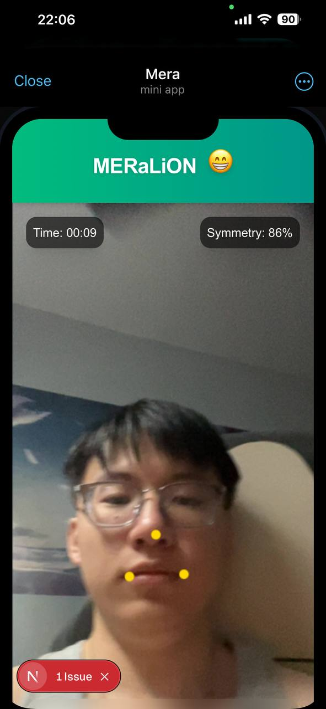

We utilize high-density **478-point facial meshes** directly in the browser to detect micro-expressions.
*   *The Purpose:* To detect early onset signs of stroke (facial drooping, bell's palsy) or general lethargy.
*   *The FSM / Logic:* Real-time euclidean distance calculation $d = \sqrt{(x_2 - x_1)^2 + (y_2 - y_1)^2}$ between key focal points (left lip corner vs right lip corner relative to the nose). It tracks symmetrical expansion ratios: $\frac{\| \vec{p}_l - \vec{p}_n \|}{\| \vec{p}_r - \vec{p}_n \|} \approx 1$. If the user only smiles with one half of their face, or the smile is weak (expansion $\Delta$ below threshold $\tau$), the state trigger holds back progression until clinical symmetry is achieved over a sustained $t \ge 3$s window.

#### C. The Heart Rate Game (Remote Photoplethysmography)
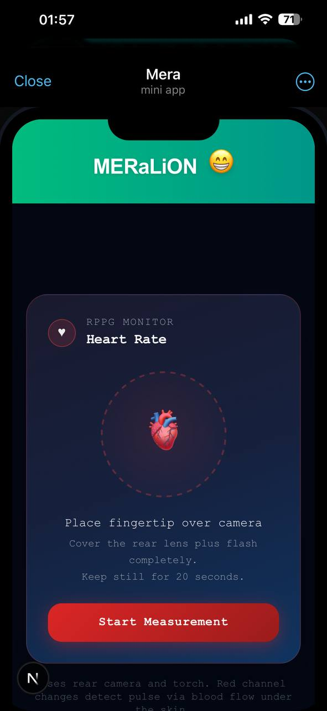

We utilize **Remote Photoplethysmography (rPPG)** to extract heart rate from subtle color changes in the skin via the device camera. The algorithm samples the red channel intensity over time, applies bandpass filtering to isolate cardiac frequencies (0.5-4 Hz), and detects peaks corresponding to heartbeats.
*   *The Purpose:* To measure resting heart rate non-invasively, detecting tachycardia or bradycardia as early indicators of cardiovascular issues.
*   *The FSM / Logic:* Real-time sampling of red pixel intensities $I_r(t)$ from a centered facial region. Bandpass filtering removes low-frequency lighting drift and high-frequency noise:

  Low-pass: $I_{lp}(t) = \frac{1}{w} \sum_{i=t-w+1}^{t} I_r(i)$ where $w = \lceil 0.15 \cdot f \rceil$ (smooths ~150ms at frame rate $f$).

  High-pass: $I_{hp}(t) = I_{lp}(t) - I_{trend}(t)$, where $I_{trend}(t) = \frac{1}{w_t} \sum_{i=t-w_t+1}^{t} I_{lp}(i)$ and $w_t = \lceil 1.5 \cdot f \rceil$ (removes slow drift over ~1.5s).

  Peak detection identifies local maxima in $I_{hp}(t)$ with minimum distance $d_{min} = \lceil 0.3 \cdot f \rceil$ (prevents double-counting). BPM is calculated as $\frac{\text{peaks}}{\Delta t} \times 60$, where $\Delta t$ is the actual elapsed time (not assumed FPS).

  The FSM enforces a 20-second measurement window, rejecting readings outside 30-220 BPM or with insufficient signal quality (variance threshold).

---

## 🚀 Extensions and Scalability: The Innovation Blueprint
This repository is heavily engineered as a **Proof of Concept Blueprint**, not a rigid product. 

1.  **Modular Skill Architecture:** Because of the Open Claw tooling, the LLM is highly extensible. We can infinitely add new skills mapping beyond its core capability—integrating hospital booking APIs, new physical mini-games (e.g., spiral drawing tests for Parkinson's), or integration with external IoT wearables (Apple Watch HR monitors), all without changing the underlying conversation engine.
2.  **Cloud-Native Transition:** While the server and SQLite database are currently localized for testing and tight-circle Hackathon deployment, the Next.js / FastAPI / LLM architecture is fully Dockerizable. If adapted by SYNAPXE or other MNCs, this can be seamlessly deployed to secure Cloud Data Centers utilizing powerful enterprise GPUs for vastly superior inference speeds and nationwide scalability. 

---

## 🏗️ Technical Development Architecture

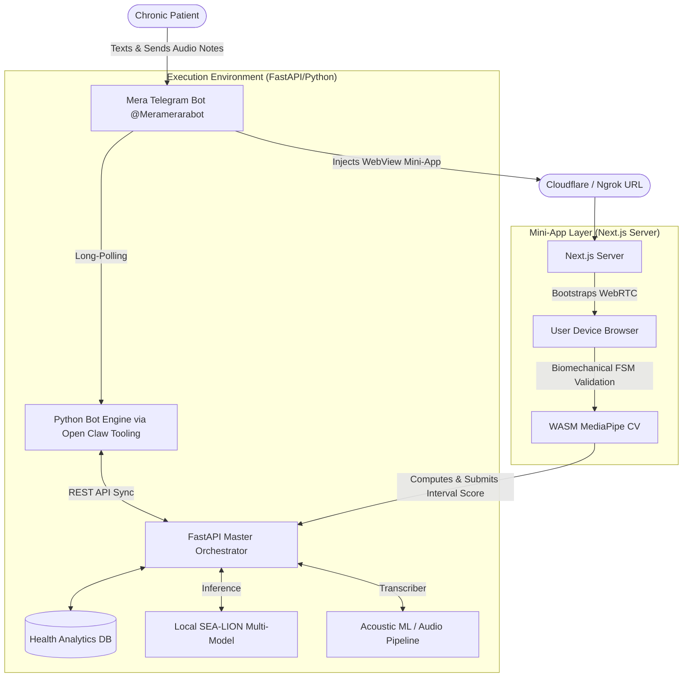

---
## 🗄️ Backend Logging & Patient Analytics Database
All patient anomalies, scores, and raw conversation metrics are safely logged into a centralized SQLite schema, allowing immediate clinical auditing or programmatic fallback.

  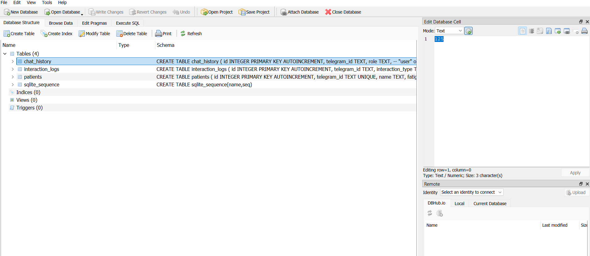
  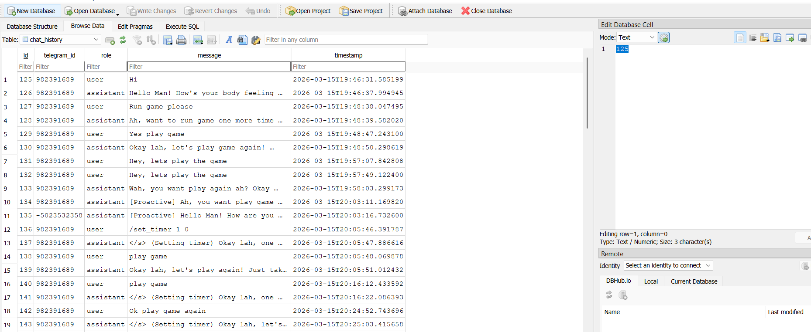

---
### 💻 Running the Repository Locally

We've designed the deployment to be completely frictionless for non-technical judges or testers, while still giving developers raw access to the underlying backend logs.

#### 🎯 For Ordinary Testers & Judges (The "1-Click" Quick Execution)
If you just want to run the full stack and see the magic, you don't need to manually touch the directories! Just use our thick, hard-coded batch scripts to auto-mount everything.

1. **First-time Setup:** run `complete-build.bat` in the root folder. It will deeply penetrate the dependency tree, fetching all Node Modules, Python properties, and checking FFmpeg dependencies for you.
2. **Launch the Stack:** run `run.bat`. This automatically opens three synchronized terminals side-by-side (giving you a full view of Next.js, FastAPI, and the PyBot orchestration) and exposes the local ports.

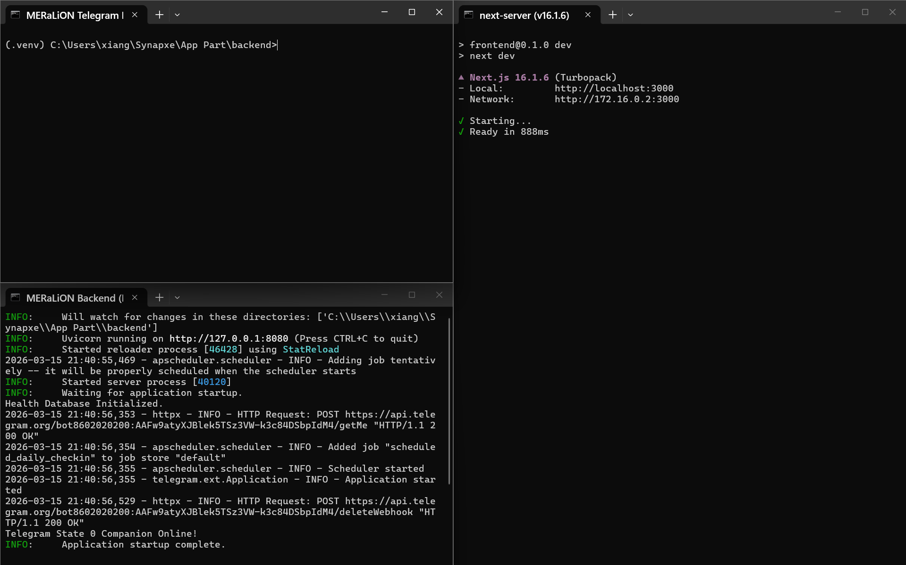

#### 🎮 Game Access Shortcuts
Once the stack is running, you can access the mini-games directly via these commands when in DM with @Meramerarabot

- **Smile Checker (Facial Symmetry):** `/play smile`
- **Mobility Workout:** `/play workout`
- **Heart Rate Monitor:** `/play heart`

