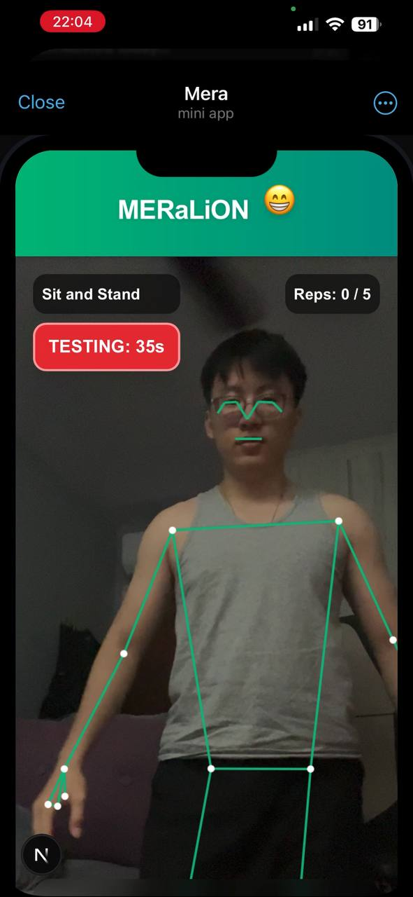

# MERaLiON Health Prototype - NUS-SYNAPXE AI Innovation Challenge 2026 🦁

## 🌟 The Pitch & Premise
**Frictionless Healthcare without Boundaries.** 
The biggest hurdle to remote healthcare monitoring in the elderly and vulnerable populations is the friction of technology—downloading apps, setting up accounts, logging in, and navigating unfamiliar UIs. 

**Why a Telegram Bot instead of a Native App?**
*   **Zero-Friction Convenience:** Telegram is an app the elderly and their families *already use* daily for communication. There is nothing new to learn or install.
*   **Unmatched Engagement:** When comparing the chances of user engagement between an isolated "Health App Push Notification" and a native "Telegram message from a friend", the chat message wins by a landslide. 
*   **Absolute Simplicity:** No tech skills are required to operate this tool. The user simply talks to the bot using text or voice. The bot operates in the background, proactively messaging at set intervals to do light check-ins and deploy tools when necessary.

**Our Solution:** We bypass app installation entirely. The entire patient journey is hosted inside **Telegram**. Using advanced Sovereign Large Language Models (SEA-LION/MERaLiON) and a highly robust **Open Claw architecture**, our solution acts as an empathetic digital companion. Through casual conversation, the system performs *background multimodal health screening*. 

When a vulnerability is detected (e.g., voice fatigue, signs of cognitive decline in audio, or depressive text), the agent dynamically triggers its tools and seamlessly launches localized **Telegram Mini Apps (WebRTC Machine Learning)** to perform active, gamified physiological assessments—all without the user ever explicitly leaving the chat.

---

## 🎯 The Problem Statement
**Tackling Problem Statement 2: AI for Multimodal Remote Health and Wellness Monitoring.**
Our platform delivers on the goal of accessible, non-contact, and continuous monitoring of wellness, stress, and physiological signals. By intelligently fusing **Audio & Linguistic analysis** (passive tracking) with **Visual Pose & Facial tracking** (active assessment), we form a comprehensive and entirely frictionless health trendline for clinicians. 

---

## 🧠 The Companion Bot: "Mera" (@Meramerarabot)


Mera serves as a deeply caring, protective digital guardian with a localized touch.

*   **Personality & Tendencies:** Warm, empathetic, yet highly protective. It speaks the user's language (integrating Singlish/regional nuances). It's explicitly designed to care deeply for the user without causing medical panic. Its built-in tendency is to disguise serious health interventions as fun minigames. (*"Eh, since you sound a bit tired recently, let's play a quick memory or stretching game to wake you up!"*)
*   **Dual-Modality Chat (Audio & Text):** 
    *   **High-Fidelity Audio Transcriber:** Capable of natively digesting voice notes. It leverages an advanced transcriber pipeline and specialized local acoustic models to screen vocal signatures for slurring, trailing pauses, and voice fatigue—early indicators of stroke or depressive cognitive decline.
    *   **Semantic Text Assessment:** Continuously parses standard text strings for conversational sentiment, instantly isolating distress keywords and emotional decay over time.

---

## ⚙️ High-Tech Implementations & The "Open Claw" Magic
The core system is vastly more than a simple chatbot—it is an ensemble of bleeding-edge tech:
1.  **Open Claw Architecture:** The dynamic backbone. The system implements versatile "Open Claw" tool-calling, granting the bot an array of skills. It autonomously routes user inputs—deciding in real-time when to invoke the audio transcriber, run clinical sentiment analysis, or deploy targeted Telegram WebApps based entirely on context.
2.  **Privacy-First WebAssembly (WASM) Vision:** Our Next.js Telegram Mini Apps perform all *camera-based facial mesh and skeletal tracking locally within the phone’s browser*. Zero video data is sent to the cloud. It calculates a 'Symmetry or Mobility Score' natively, ensuring 100% data privacy and frictionless deployment. 
3.  **Local Edge Inference (SEA-LION / MERaLiON):** Relying on IMDA/AI Singapore's models optimized for Southeast Asian cultural grounding.

---

## 🔄 The System Finite State Machines (FSM)

### 1. Macro Application FSM (The Patient Journey)
*   **State 0: Empathic Surface (Idle Monitoring):** The bot engages in standard companionship text/audio chat. Natural transcribers and NLP models parse incoming modalities continuously.
*   **State 1: Dynamic Escalation (The Bridge):** An anomaly is logged via the transcribers/ML (e.g., negative text threshold crossed). The LLM automatically transitions priority from "Chat" to "Diagnostics", utilizing Open Claw to inject a diagnostic Mini App button.
*   **State 2: Active Gamified Assessment (Visual/Motor):** The user engages the WebApp over their camera. Client-side MediaPipe tracks high-framerate skeletal joints or 478-point facial meshes.
*   **State 3: Data Aggregation & Intervention:** The game computes interval metrics, POSTs to the FastAPI backend, evaluates the timeline curve, and orchestrates caretaker alerts if critical thresholds are broken.

### 2. Micro Gameplay FSM (Clinical Visual Tracking)
Within our Next.js frontend, we employ rigorous biomechanical State Machines to guarantee clinical compliance, bypassing any ability for the user to "cheat" the camera.


#### A. The Active Mobility Game


We dynamically map **33 body posture landmarks** in 3D space, calculating strict angular thresholds (e.g. knee-flexion, shoulder-to-hip bounds).
*   **Exercise 1: Sit-to-Stand Test** 
    *   *The Purpose:* Clinically validated indicator of lower body strength and fall risk in geriatrics. 
    *   *The FSM:* STANDING ➡️ SIT_DOWN (Transition requires hip Y-coordinates dropping below threshold) ➡️ SITTING ➡️ STAND_UP (Requires full knee extension angle ~180°). 
*   **Exercise 2: Standing March Test (Left/Right Coordination)**
    *   *The Purpose:* Tests balance and cross-lateral motor control.
    *   *The FSM:* STANDING_IDLE ➡️ LEFT_KNEE_UP (Angles calculated to ensure knee reaches hip height) ➡️ FOOT_DOWN ➡️ RIGHT_KNEE_UP. The strict FSM prevents rapidly spamming one leg or partial lifts.

#### B. The Smile Checker (Facial Motor Game)


We utilize high-density **478-point facial meshes** directly in the browser to detect micro-expressions.
*   *The Purpose:* To detect early onset signs of stroke (facial drooping, bell's palsy) or general lethargy.
*   *The FSM / Logic:* Real-time euclidean distance calculation between key focal points (left lip corner vs right lip corner relative to the nose). It tracks symmetrical expansion. If the user only smiles with one half of their dimension, or the smile is weak, the state trigger holds back progression until clinical symmetry is achieved over a sustained 3-second window.

---

## 🚀 Extensions and Scalability: The Innovation Blueprint
This repository is heavily engineered as a **Proof of Concept Blueprint**, not a rigid product. 

1.  **Modular Skill Architecture:** Because of the Open Claw tooling, the LLM is highly extensible. We can infinitely add new skills mapping beyond its core capability—integrating hospital booking APIs, new physical mini-games (e.g., spiral drawing tests for Parkinson's), or integration with external IoT wearables (Apple Watch HR monitors), all without changing the underlying conversation engine.
2.  **Cloud-Native Transition:** While the server and SQLite database are currently localized for testing and tight-circle Hackathon deployment, the Next.js / FastAPI / LLM architecture is fully Dockerizable. If adapted by SYNAPXE or other MNCs, this can be seamlessly deployed to secure Cloud Data Centers utilizing powerful enterprise GPUs for vastly superior inference speeds and nationwide scalability. 

---

## 🏗️ Technical Development Architecture

`mermaid
flowchart TD
    User([Elderly User]) -->|Texts & Sends Audio Notes| Telegram[Mera Telegram Bot @Meramerarabot]
    
    subgraph "Execution Environment (FastAPI/Python)"
        Telegram --> |Long-Polling| PyBot[Python Bot Engine via Open Claw Tooling]
        PyBot <--> |REST API Sync| FastAPI[FastAPI Master Orchestrator]
        FastAPI <--> SQLite[(Health Analytics DB)]
        FastAPI <--> |Inference| Ollama[Local SEA-LION Multi-Model]
        FastAPI <--> |Transcriber| ML[Acoustic ML / Audio Pipeline]
    end

    subgraph "Mini-App Layer (Next.js Server)"
        NextJS[Next.js Server]
        NextJS -- Bootstraps WebRTC --> ClientDevice[User Device Browser]
        ClientDevice -- Biomechanical FSM Validation --> Browser[WASM MediaPipe CV]
    end

    Cloudflare([Cloudflare / Ngrok URL]) --> NextJS
    Telegram --> |Injects WebView Mini-App| Cloudflare
    Browser --> |Computes & Submits Interval Score| FastAPI
```

---
## 🗄️ Backend Logging & Patient Analytics Database
All patient anomalies, scores, and raw conversation metrics are safely logged into a centralized SQLite schema, allowing immediate clinical auditing or programmatic fallback.

<div style="display: flex; gap: 10px;">
  
  
</div>

---
### 💻 Running the Repository Locally
Please refer to the `complete-build.bat` and `run.bat` initialization scripts. They automate the creation of Python virtual environments, fetching Node dependencies, and spinning up the tri-pane (Next.js, FastAPI, Telegram Bot) micro-service architecture concurrently.


